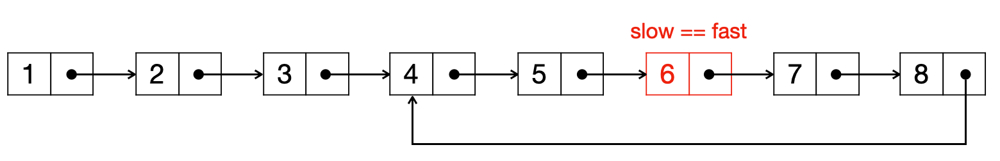

# [142] Linked List Cycle II

|     Tag     |       Similar Problem        |  Difficulty   |
| :---------: | :--------------------------: | :-----------: |
| `fast/slow` `Floyd’s Cycle Detection Algorithm` | 142 | 🌟🌟 |

* You can find this problem here：[142. Linked List Cycle II](https://leetcode.com/problems/linked-list-cycle-ii/)

  

### Problem definition：

Given a linked list, return the node where the cycle begins. If there is no cycle, return `null`.

To represent a cycle in the given linked list, we use an integer `pos` which represents the position (0-indexed) in the linked list where tail connects to. If `pos` is `-1`, then there is no cycle in the linked list.

**Note:** Do not modify the linked list.


### Example

```
Input: head = [3,2,0,-4], pos = 1
Output: tail connects to node index 1
Explanation: There is a cycle in the linked list, where tail connects to the second node.

3 -> 2 -> 0 -> 4
     |_________|
```


### Special cases:

1. 链表为空，e.g. `[]`
2. 链表只有一个结点，e.g. `[1]`


### Solution:

```python
class Solution:
    def hasCycle(self, head: ListNode) -> bool:
        slow = fast = head
        while fast and fast.next: #避免单结点的 special case
            slow = slow.next 
            fast = fast.next.next 
            if slow == fast: # 开始寻找环起始点
                slow = head
                while (slow!=fast):
                    slow = slow.next
                    fast = fast.next
                return slow
        
        return None
```


### Floyd’s Cycle Detection Algorithm 

Floyd’s Cycle Detection Algorithm is a pointer algorithm that uses only two pointers, which move through the sequence **at different speeds**. 

The idea is to move `fast` pointer **twice as quickly as** the `slow` pointer and the distance between them increases by 1 at each step. If at some point both meet, we have found a cycle in the list, else if we have reached the end of the list, no cycle is present. 

**When `slow` and `fast` meet each other, move `slow` to the `head`, let both `slow` and `fast` move at one step a time. When they finally meet each other, that is the node where the cycle begins.**



#### Prove

Assume when `slow` and `fast` met each other, `slow` walked `k` steps, then `fast` walked `2k` steps

* let `s` stand for the distance from the start of the linklist to where circle begins
* let `m` stand for the distance from where circle begins to the meeting point
* let `r` stand for the length of circle

So, when `slow` and `fast` met each other, they may have been travel the circle `n` times

```
2k - k = nr
s = k - m
s = nr - m
s = (n-1)r + r-m
when n = 1
s = r - m
```

Therefore, `s` stands for the distance from the start of linklist to where circle begins, `r-m` stands for the meeting point to where circle begins. so, this proves that **When `slow` and `fast` meet each other, move `slow` to the `head`, let both `slow` and `fast` move at one step a time. When they finally meet each other, that is the node where the cycle begins.**

