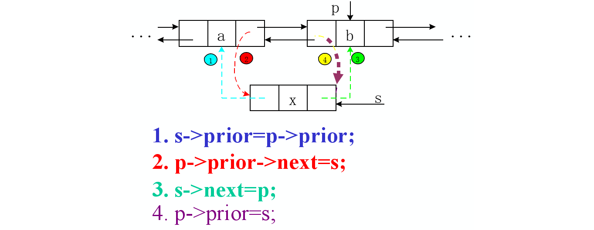
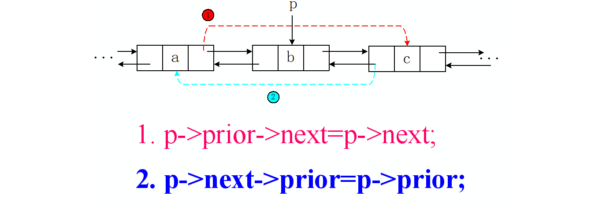

# [707] Design Linked List

|    Tag     | Similar Problem | Difficulty |
| :--------: | :-------------: | :--------: |
| `linklist` |                 |    🌟🌟🌟🌟    |

* You can find this problem here：[707. Design Linked List](https://leetcode.com/problems/design-linked-list/)


### Problem definition：

Design your implementation of the linked list. You can choose to use the singly linked list or the doubly linked list. A node in a singly linked list should have two attributes: `val` and `next`. `val` is the value of the current node, and `next` is a pointer/reference to the next node. If you want to use the doubly linked list, you will need one more attribute `prev` to indicate the previous node in the linked list. Assume all nodes in the linked list are 0-indexed.

Implement these functions in your linked list class:

- `get(index)` : Get the value of the `index`-th node in the linked list. If the index is invalid, return `-1`.
- `addAtHead(val)` : Add a node of value `val` before the first element of the linked list. After the insertion, the new node will be the first node of the linked list.
- `addAtTail(val)` : Append a node of value `val` to the last element of the linked list.
- `addAtIndex(index, val)` : Add a node of value `val` before the `index`-th node in the linked list. If `index` equals to the length of linked list, the node will be appended to the end of linked list. **If index is greater than the length, the node will not be inserted.**
- `deleteAtIndex(index)` : Delete the `index`-th node in the linked list, if the index is valid.


### Example:

```
Input: 
	["MyLinkedList","addAtHead","addAtTail","addAtIndex","get","deleteAtIndex","get"]
	[[],[1],[3],[1,2],[1],[1],[1]]
Output:  
	[null,null,null,null,2,null,3]

Explanation:
  	MyLinkedList linkedList = new MyLinkedList(); // Initialize empty LinkedList
  	linkedList.addAtHead(1);
  	linkedList.addAtTail(3);
  	linkedList.addAtIndex(1, 2);  // linked list becomes 1->2->3
  	linkedList.get(1);            // returns 2
  	linkedList.deleteAtIndex(1);  // now the linked list is 1->3
  	linkedList.get(1);            // returns 3
```


### Error Prone:

1. The linked list are 0-indexed, which means the first index is 0

2. In `get` function:

   1. Instead of comparing the length of the linklist and the index to judge whether an index is valid( too many cases), it's better just to move a pointer `p` to the index(assume all the index is valid), and judge whether `p == None`

      ```python
      p = self.dummy
      i = -1
      while p and i<index:
          p = p.next
          i += 1
      if p:
          return p.val
      else:
          return -1
      ```

3. In `addAtHead` function:

   1. when using **doubly linked list**, the special case of this function is when the linklist is empty, then the following code will fail.

      ```python
      head = self.dummy.next
      newNode.prev = self.dummy
      self.dummy.next = newNode
      newNode.next = head
      head.prev = newNode # head == None, head has no prev attribute
      ```

      when `head == None`, `head` has no `prev` attribute, so it should be modified as follow.

      ```python
      head = self.dummy.next
      newNode.prev = self.dummy
      self.dummy.next = newNode
      if head:
          newNode.next = head
          head.prev = newNode
      ```

4. In `addAtIndex` function:

   

   2. Again, as `get` function, instead of comparing the length of the linklist and the index to judge whether an index is valid( too many cases), it's better just to move a pointer `p` to the index(assume all the index is valid), and judge whether `p == None`

      ```python
      p = self.dummy
      i = -1
      while p and i<index:
          p = p.next
          i += 1
      if p:
          newNode.prev = p.prev
          newNode.prev.next = newNode
          newNode.next = p
          p.prev = newNode
      ```

   3. The special case of this function is, when `index == len` which equals to `addAtTail()`. According to  above principle, when `index == len`, `p == None`, which means this function fails and no new node will be inserted to the list. The solution is to separate this special case of `index` with the rest invalid indices.

      ```python
      p = self.dummy
      i = -1
      newNode = Node(val)
      while p and i<index:
          p = p.next
          i += 1
      
      if not p and i==index: # addAtTail:
          self.addAtTail(val)
      
      if p:
          newNode.prev = p.prev
          newNode.prev.next = newNode
          newNode.next = p
          p.prev = newNode 
      ```

5. In `deleteAtIndex` function:

   

   2. when using **doubly linked list**, the special case of this function is when delete the last node, say `last`, `last` has no `prev` attribute.

      ```python
      p = self.dummy
      i = -1
      while p and i<index:
          p = p.next
          i += 1
      
      if p:
          p.prev.next = p.next
          if p.next: # judge whether it is the last node which has no prev attribute
              p.next.prev = p.prev
      ```


### Solution:

* Time complexity: $O(n)$
* Space conplexity: $O(1)$

```python
class Node:
    def __init__(self,x):
        self.val = x
        self.next = None
        self.prev = None

class MyLinkedList:

    def __init__(self):
        """
        Initialize your data structure here.
        """
        self.dummy = Node(None)


    def get(self, index: int) -> int:
        """
        Get the value of the index-th node in the linked list. If the index is invalid, 				return -1.
        """
        p = self.dummy
        i = -1
        while p and i<index:
            p = p.next
            i += 1

        if p:
            return p.val
        else:
            return -1

    def addAtHead(self, val: int) -> None:
        """
        Add a node of value val before the first element of the linked list. After the insertion, the new node will be the first node of the linked list.
        """
        newNode = Node(val)
        head = self.dummy.next
        newNode.prev = self.dummy
        self.dummy.next = newNode
        if head:
            newNode.next = head
            head.prev = newNode


    def addAtTail(self, val: int) -> None:
        """
        Append a node of value val to the last element of the linked list.
        """
        p = self.dummy
        newNode = Node(val)
        while p.next:
            p = p.next

        p.next = newNode
        newNode.prev = p


    def addAtIndex(self, index: int, val: int) -> None:
        """
        Add a node of value val before the index-th node in the linked list. If index equals to the length of linked list, the node will be appended to the end of linked list. If index is greater than the length, the node will not be inserted.
        """
        p = self.dummy
        i = -1
        newNode = Node(val)
        while p and i<index:
            p = p.next
            i += 1
        
        if not p and i==index:
            self.addAtTail(val)

        if p:
            newNode.prev = p.prev
            newNode.prev.next = newNode
            newNode.next = p
            p.prev = newNode


    def deleteAtIndex(self, index: int) -> None:
        """
        Delete the index-th node in the linked list, if the index is valid.
        """
        p = self.dummy
        i = -1
        while p and i<index:
            p = p.next
            i += 1
        if p:
            p.prev.next = p.next
            if p.next:
                p.next.prev = p.prev
```


